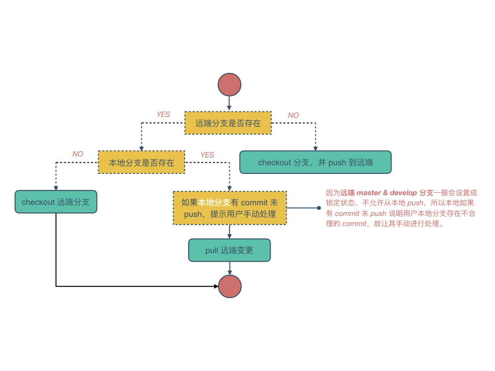
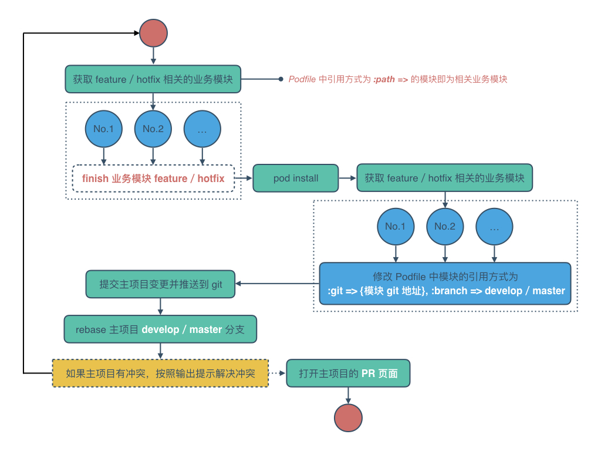
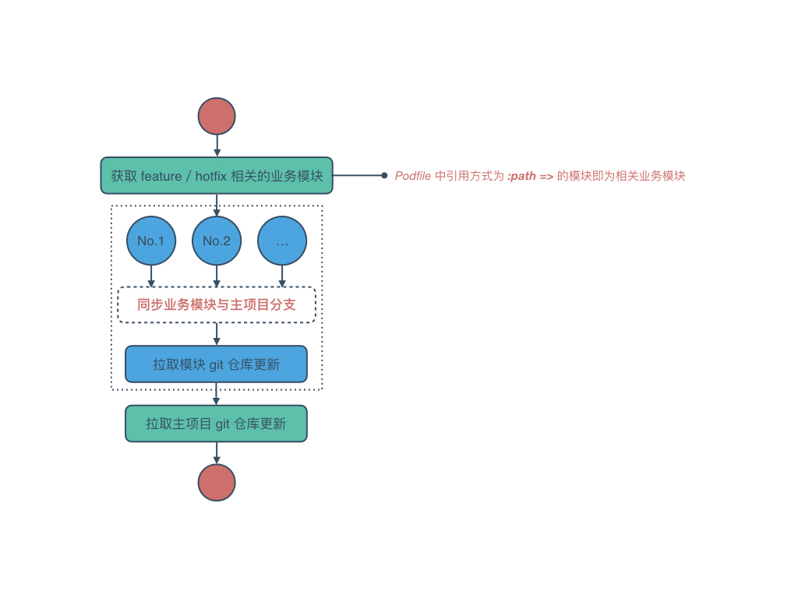

# feature - 功能开发流程 & hotfix - 线上修复流程

> 注：hotfix 除了基础分支是 **master**，其他操作和 feature 一致，所以我们这里以 feature 为例说明。

直接在命令行执行 `bigkeeper feature --help` 可以查看其提供的所有功能：

```
NAME
    feature - Feature operations


SYNOPSIS
    bigkeeper [global options] feature delete
    bigkeeper [global options] feature finish
    bigkeeper [global options] feature list
    bigkeeper [global options] feature pull
    bigkeeper [global options] feature push
    bigkeeper [global options] feature start
    bigkeeper [global options] feature switch
    bigkeeper [global options] feature update

COMMANDS
    delete - Delete feature with name
    finish - Finish current feature
    list   - List all the features
    pull   - Pull remote changes for current feature
    push   - Push local changes to remote for current feature
    start  - Start a new feature with name for given modules and main project
    switch - Switch to the feature with name
    update - Update modules for the feature with name
```

功能列表如下：

- start：
  开始一个新的 feature，输入参数依次为：
  - feature 的名字;
  - 开发该 feature 需要改动的业务模块名。可以多个，用空格隔开；如果不指定，取 **Bigkeeper 文件中所有的业务模块名**。
- finish：结束当前 feature；
- switch：切换到一个已经存在的 feature，输入参数为 feature 名；
- update：
  更新一个 feature 需要改动的业务模块，输入参数依次为：
  - feature 的名字;
  - 开发该 feature 需要改动的业务模块名。可以多个，用空格隔开；如果不指定，取 **Bigkeeper 文件中所有的业务模块名**。
- pull：拉取当前 feature 主项目和业务模块的远程 git 仓库更新；
- push：提交并推送当前 feature 主项目和业务模块的本地变更到远程 git 仓库，输入参数为提交信息；
- delete：根据 featue 名删除主项目和业务模块所有相关分支；（PS：慎用，因为会删除本地和远程所有相关分支）
- list：显示当前的 feature 列表。

## 各个流程的使用场景

- 如果需要开发新的功能，使用 bigkeeper feature start；
- 开发功能过程中如果发现某个模块其实不用改动，使用 bigkeeper feature update 来把这个模块从这个 feature 移除；
- 使用 bigkeeper feature pull 来同步主项目和相关业务模块远端变更；
- 使用 bigkeeper feature push 来推送主项目和相关业务模块变更到远端；
- 使用 bigkeeper feature switch 来切换 feature，比如：两个功能并行开发的时候，就可以用这个命令互相切换了；
- 功能开发完成，需要提交 PR 时，使用 bigkeeper feature finish 结束开发；
- 如果开发过程中突然有新的功能需要紧急开发，直接使用 bigkeeper feature start 进行新功能开发，就功能未提交的内容我们会保存在 stash 中。

## feature 的工作区


feature 的工作区主要由两部分组成：

- 主项目；
- 相关业务模块，我们把 Podfile 中引用方式为 `:path => {业务模块本地路径}` 的模块做为相关业务模块。

主项目和每个相关业务模块又有各自的工作区，由三个部分组成：

- 当前代码区改动；
- stash 缓存区，当用户需要切换新的 feature 时，对于用户来不及提交的改动，我们会缓存到各个项目的 stash 中，（PS：所以代码突然不见了不要担心，都在 git 的 stash 里面），而当用户切换回某个 feature 时，我们会把和该 feature 分支同名的 stash 恢复回来，从而使用户可以继续开发之前未完成的部分，因为需要通过 feature 的分支名来匹配 stash，而 git stash 又没有提供给 stash 命名的功能，所以我们实现了 [big-stash](https://github.com/BigKeeper/big-stash) 来完成这个功能；
- git。

## 工作区缓存流程


## master／develop 分支状态检查流程



## 切换分支流程


## 同步业务模块与主项目分支流程


## finish 业务模块 feature／hotfix 流程


## 从 feature／hotfix 移除模块流程


## feature start 流程


## feature finish 流程



## feature switch 流程


## feature update 流程


## feature pull 流程



## feature push 流程


