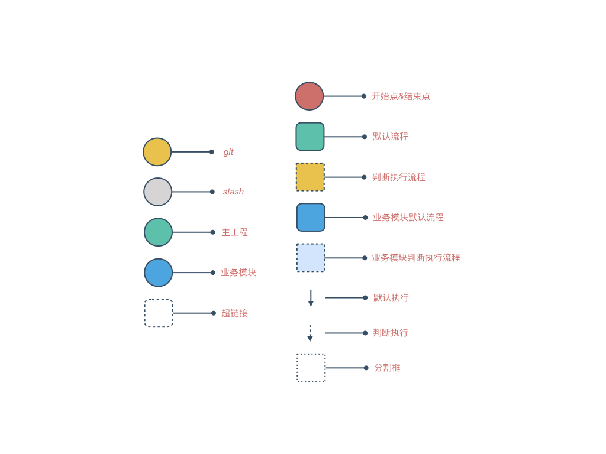

[English](../../README.md)

---

# bigkeeper

[](https://travis-ci.org/BigKeeper/bigkeeper)
[](https://codeclimate.com/github/BigKeeper/big-keeper/maintainability)
[](https://rubygems.org/gems/big_keeper)
[](https://www.ruby-lang.org/)
[](https://github.com/BigKeeper/big-keeper/blob/master/LICENSE)
[](https://gitter.im/Big-Keeper/Lobby)

bigkeeper 是一个** iOS&Android 模块化项目**效率提升工具，使用这个工具后，开发者**在主项目内**即可完成**包括其他业务模块在内**所有代码的编写和管理。

> 注：目前只支持依赖 CocoaPods 管理的模块化工程。

我们借鉴 CocoaPods 的做法，开发团队只需要在主项目中加入一个 Bigkeeper 文件，然后利用我们提供的 `bigkeeper` 工具，即可更便捷的实现**代码分支**和**业务模块**的管理；另外，通过我们提供的工具，也能帮助开发者养成更规范的日常开发习惯，减轻项目管理者的负担。

## 应用场景

在模块化项目的过渡阶段，我们往往会碰到业务拆分不是那么彻底的情况（PS：比如主项目中仍然存在业务相关代码），这样就会导致一系列问题：

- 开发者开发一个 feature 时需要维护多个项目的分支，同时还要频繁修改主项目的 `Podfile`;
- 项目管理者需要花很大精力去和团队成员同步项目管理规范流程，尤其对于新人，挑战很大；
- 开发过程中如果碰到突发情况需要开新分支处理问题时对当前工作区的保存操作会很繁琐（PS：因为涉及到多个项目）；
- 日常开发过程中类似 commit、pull、push 等操作比较繁琐（PS：因为涉及到多个项目）。

bigkeeper 的出现就是为了解决这些问题。

> 注：也有很多人认为直接做一个完整的组件化项目更合理，而不需要采用这样曲折的方案，但是很多时候我们并没有这么多的精力直接去做这些事情，bigkeeper 存在的价值也是为了帮助开发团队在** iOS&Android 模块化项目过渡阶段**能更轻松的往前走。

## 安装

- 当作 Ruby Gem 使用：
  在项目的 Gemfile 中加入下面这行：

  ```ruby
  gem 'big_keeper'
  ```

  然后执行：

    $ bundle

- 直接安装：

    $ gem install big_keeper

## 使用方法

> 注：每个流程我们都提供详细的流程图来让你了解我们都做了些什么，为了方便你更好的了解我们的流程，我们提供了一个流程参考图，如下：
>
> 

- [Bigkeeper 文件配置](BIGKEEPER_FILE.md)
- `bigkeeper` 工具使用：

  直接在命令行执行 `bigkeeper` 可以查看其提供的所有功能：

  ```
  NAME
      bigkeeper - Efficiency improvement for iOS&Android modular development, iOSer&Android using this tool can make modular development easier.

  SYNOPSIS
      bigkeeper [global options] command [command options] [arguments...]

  GLOBAL OPTIONS
      --help         - Show this message
      -p, --path=arg - (default: ./)
      -u, --user=arg - (default: mmoaay)

      -v, --ver=arg  - (default: Version in Bigkeeper file)

  COMMANDS
      feature - Feature operations
      help    - Shows a list of commands or help for one command
      hotfix  - Hotfix operations
      podfile - Podfile operation
      release - Release operations
      version - Version
  ```

  全局参数如下：

  - -p, --path：主项目所在的目录，默认是执行 bigkeeper 命令的当前目录；
  - -v, --ver：版本号，如果没有指定的话，会以主项目 [Bigkeeper 文件](BIGKEEPER_FILE.md)中指定的版本为准。
  - -u, --user：用户名，默认是 git global config 的 user.name，会显示在命令提示信息中，比如上述提示信息中的默认用户名是 mmoaay

  功能列表如下：

  - [feature](FEATURE&HOTFIX.md)：功能开发流程；
  - [hotfix](FEATURE&HOTFIX.md)：线上修复流程；
  - [release](RELEASE.md)：发布流程；
  - [podfile](PODFILE.md)：Podfile 操作流程；
  - version：查看 bigkeeper 当前版本号；
  - help：查看 bigkeeper 帮助文档。

## 其他

- [一些建议](RECOMMEND.md)

## 协议


bigkeeper 基于 MIT 协议进行分发和使用，更多信息参见协议文件。
